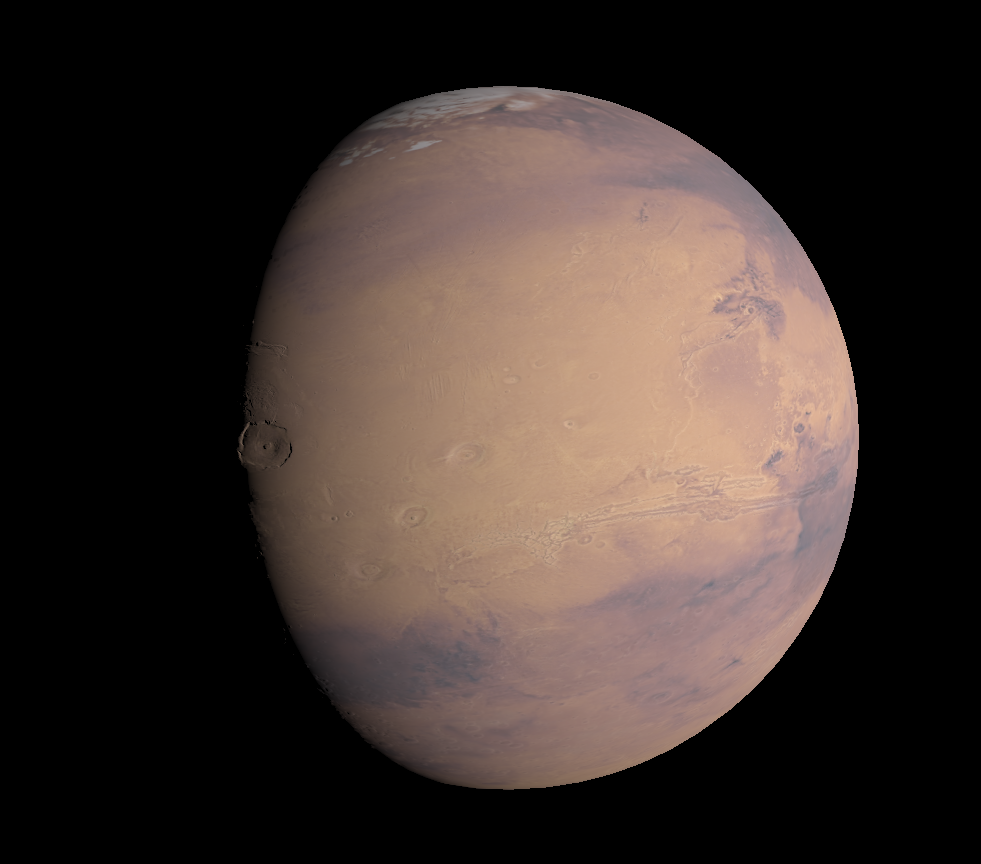

# Lucas's Mars lander graphics extension

The build requirements are modern versions of [mesa](https://mesa3d.org/) (to provide modern OpenGL APIs), [glbinding](https://github.com/cginternals/glbinding#install-instructions) (to provide OpenGL APIs function loading), [glfw](https://github.com/glfw/glfw) (to create the display) and `cmake`:
```sh
cmake -B build/ -DCMAKE_BUILD_TYPE=Release
cmake --build build/ --config Release --target all --
cd build/
LanderApp.exe
```

Screenshot demonstrating the normal mapped per-pixel lighting and gamma correction after rasterization of the color map:
